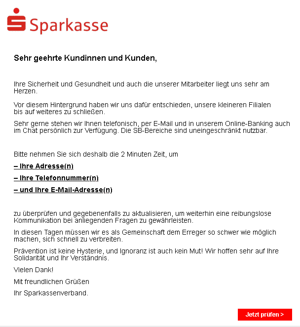

## Phishing-E-Mails erkennen 

> Können Sie Phishing-E-Mails erkennen?

## Warum ist das wichtig? 
Cyberkriminelle nutzen sehr erfolgreich aktuelle Situationen, wie wir sie derzeit gerade erleben und verschicken Corona-Phishing-E-Mails. Beispiele 
sammelt die Verbraucherzentrale unter <a href="https://www.verbraucherzentrale.nrw/aktuelle-meldungen/digitale-welt/achtung-phishing-wie-betrueger-die-coronakrise-in-emails-nutzen-45714" target="_blank">diesem Link</a>.

Den Kriminellen geht es also darum, Sie dazu zu bringen, persönliche Daten wie beispielsweise PIN, Girokontonummer oder Kreditkartennummer preiszugeben. Die Phishing-E-Mail wird dazu so konstruiert, dass sie Vertrauen schafft und den Eindruck erweckt, von einem echten Anbieter zu stammen. Meistens arbeiten die Kriminellen mit einem Link, der Sie zu einer Seite mit einer Eingabemaske für persönliche Daten führt.

## Beispiele

Quelle: Malwarebytes

Quelle: Verbraucherzentrale NRW

## Maßnahmen 
Die Verbraucherzentrale hilft Ihnen ebenfalls bei dem Erkennen solcher E-Mails. <a href="https://www.verbraucherzentrale.de/sites/default/files/2018-11/Phishing_und_trojanische_Pferde_Angriffe_auf_den_eigenen_PC_erkennen_und_abwehren.pdf" target="_blank">Hier</a> finden sie entsprechende Informationen. 

Testen Sie Ihr Wissen auf einer Seite von <a href="https://phishingquiz.withgoogle.com/ " target="_blank"> Google, hier. </a>
